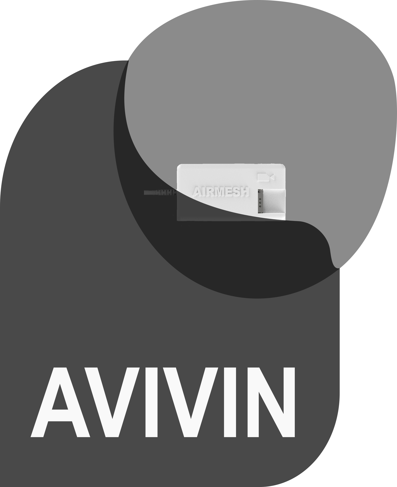

Airmesh Documentation
======================

Welcome to the Airmesh documentation!

Airmesh enables real-time drone control over cellular networks and the internet. Follow the step-by-step instructions in this guide to set up and use Airmesh effectively.

**Key Features:**
- Real-time two-way communication between GCS and UAVs, including GPS position and battery status.
- Full data logging for mission analysis with graphs and mapping tools.
- Customization and tuning capabilities for advanced users.

---

.. toctree::
   :maxdepth: 2
   :caption: Contents:

   prerequisites
   vpn_configuration
   setup
   flight_control
   ground_control_station

---

**Need Help?**
- Contact: support@airmesh.com
- Community Forum: [https://community.airmesh.com](https://community.airmesh.com)
- GitHub Repository: [Airmesh GitHub](https://github.com/your-repo)
